## Rendering

#### Rendering Overview
* Templates: phthml files that contain HTML, JS, and PHP.
  * can use any rendering system but phtml is the default.
* Blocks: allow you to move reusable functionality form PHP template files into classes so they can be repurposed for other templates.
* UIComponents: piece of UI that are rendered by JS but still depend on backend to obtain data.
* Design Layout files pull together the entire set of template files to be rendered.

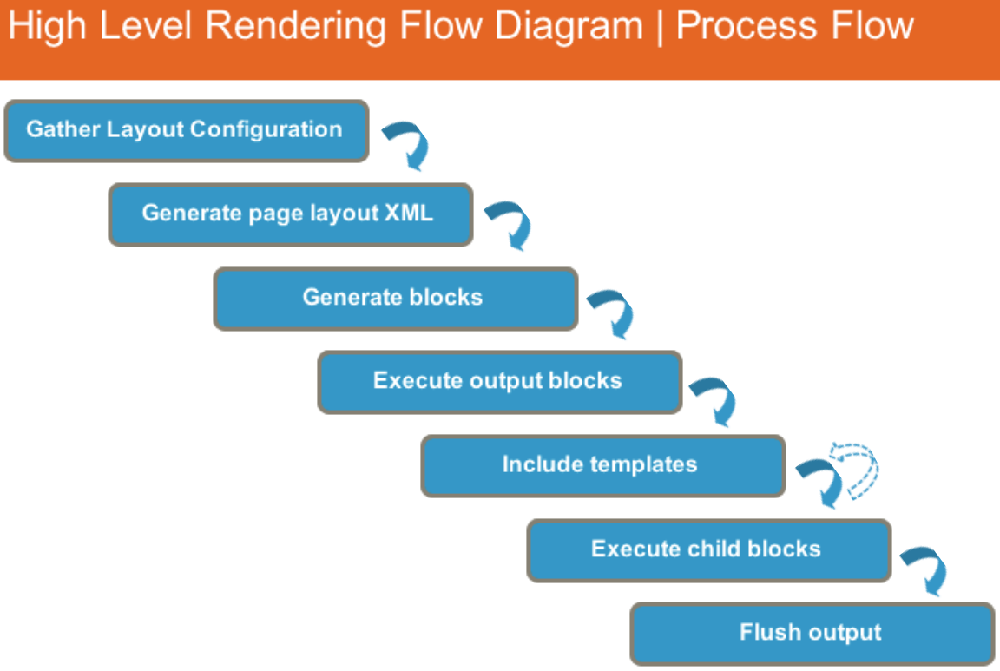

#### Rendering Flow
* result object, page object.

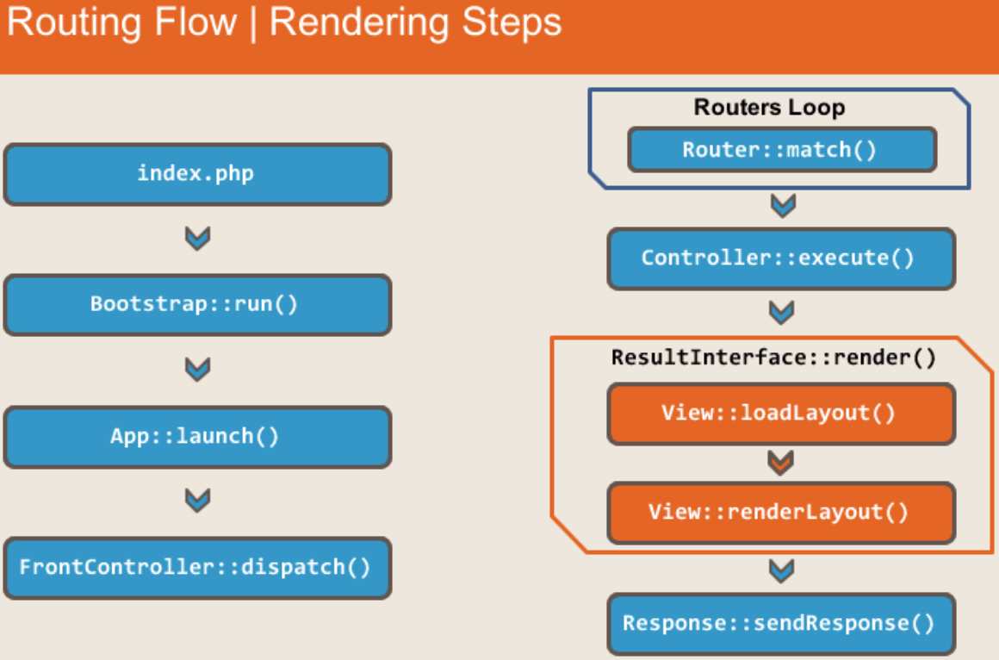

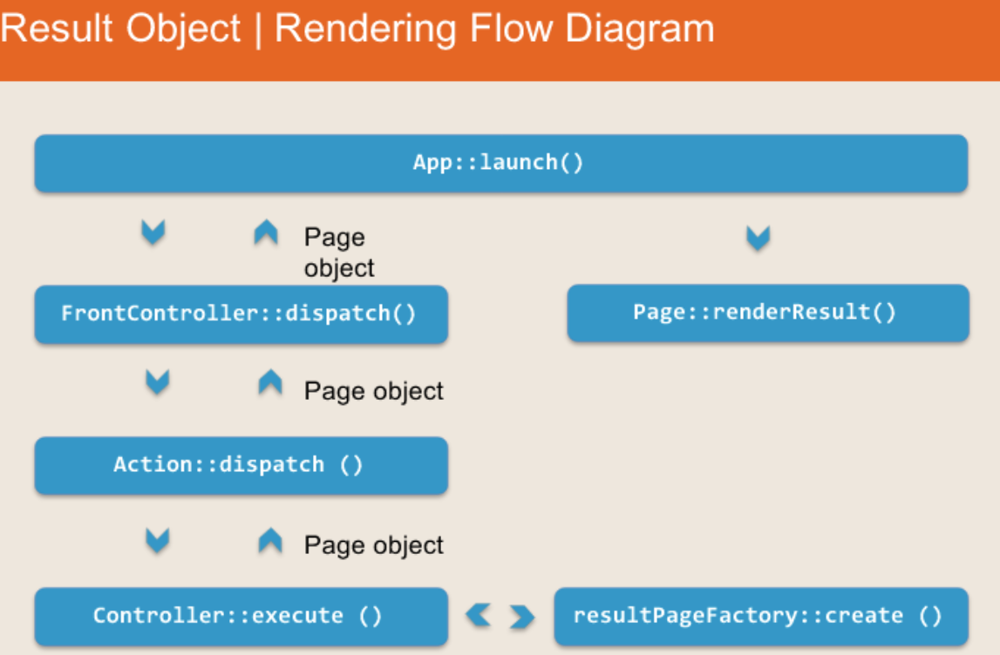

Result Objects  
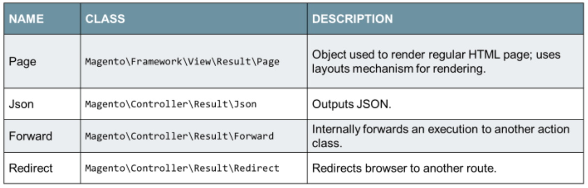

Page Render  
>  ```appendBody``` will add generated html to the response object.  Variables are obtained in the ```render()``` method and  are echoed in the ```renderPage()``` which includes the root template.

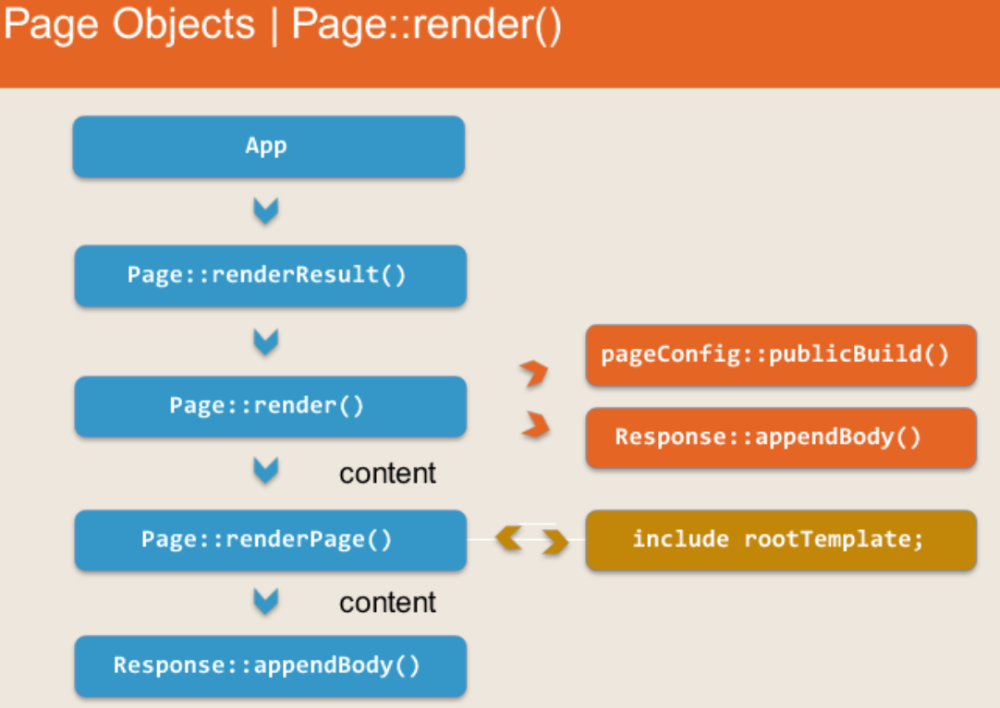

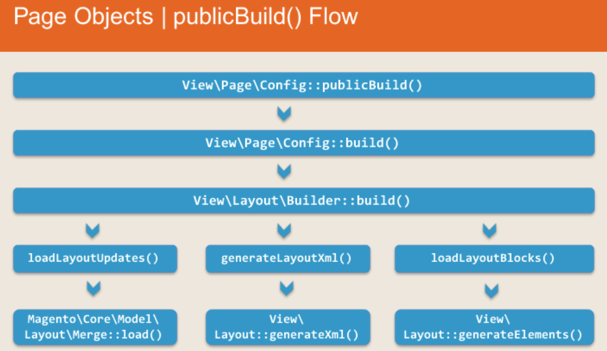

#### View Elements
* Containers, Blocks, UIComponents

###### UIComponents
* Standalone UI components that can be represented on the page and rendered using Javascript.

###### Containers
* Container: Doesn't have classes related to it, renders all its children, allows configuration of some attributes.
  * cannot create instances of Containers because they are an abstract concept where as you can with blocks.

###### Blocks
* Layout is determined by containers which act as a framework but do not contain any actual content.
* The content segments are called blocks, examples would be page title, filter navigation.
  * blocks can be viewed as elements of a page.
* blocks are only defined in sequence, the look depends on the layout and CSS.
* Templates draw elements, and blocks contain the data or a method to access the data.
* Before including rootTemplate, in Page::render(), it executes Layout::getOutput() which renders most of the content on the page.

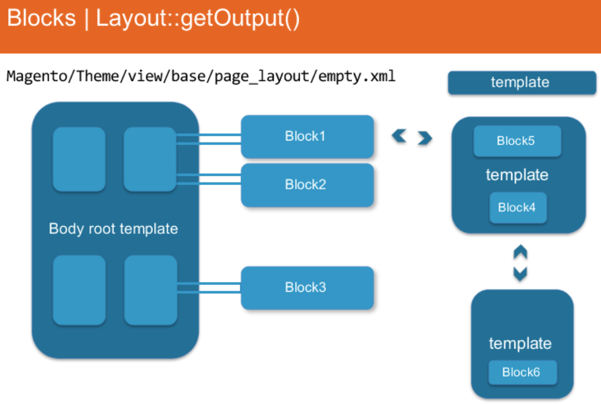

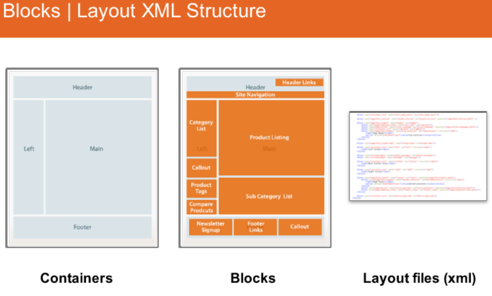


#### Block Architecture and Life Cycle

###### BlockInterface
```PHP
<?php
phptoHtml()
```

###### AbstractBlock
```php
<?php
/**
* Method that is executed when a block is created, often re-declared with specific block and contains init ops.
*/
_prepareLayout()

/**
 * Since blocks are hierarchical, needs to be methods to add/remove/find/sort children.
 */
addChild()

/**
 * These are methods that are executed right before rendering, also re-declared quite often in blocks.
 * This is the execution flow.  Best to overwrite _toHtml(), where each block type can render it's specific logic, not
 * toHtml().
 */
 toHtml()
_beforeToHtml()
_toHtml()
_afterToHtml()
```
###### Block Types
* Text, ListText, Messages, Redirect, Template
* **Text**: renders Text.
* **ListText**: instance of Text, renders all children.
* **Messages**: Contains list of messages, can have a template, render different types of messages.
* **Redirect**: Template block, renders javascript redirect.
* **Template**: .phtml files, sends to a block.
  * Assigning template files with ```setTemplate()``` use when you have physical access to the block instance.  Constructor argument, in the data array then goes to the ```_construct()``` method.
* Render Template flow: ``` Block::_toHtml() -> Block::fetchView() -> templateEngine::render() -> include $file; ```
* Create & Customize blocks:
  1. **Using layout**: by calling ```$layout->createBlock()```
  2. **Using object manager**: no need for declaration
  3. **Can be customized using DI/plugins**: as with other classes
* **Block Life Cylce**: generating, and rendering.
  * Instances of all blocks based on layout are created.
  * Structure is built and children of blocks are set.
  * ```_prepareLayout()``` method is called on every block.
  * Nothing rendered yet.

  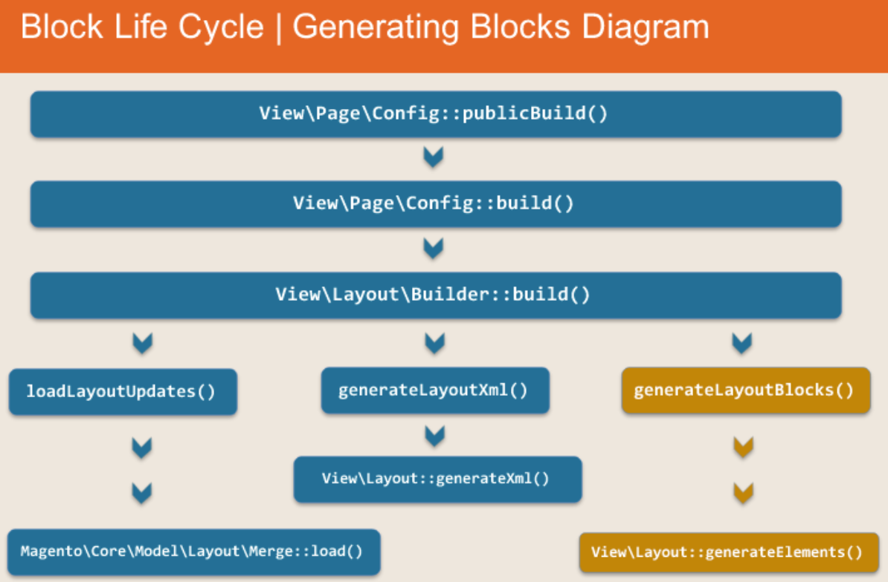

  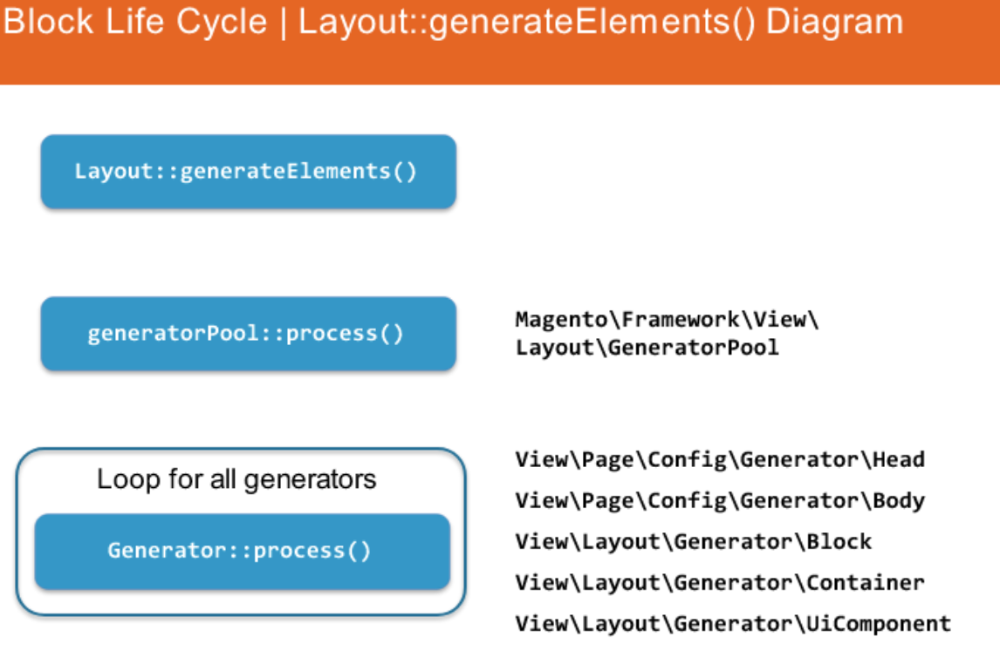

  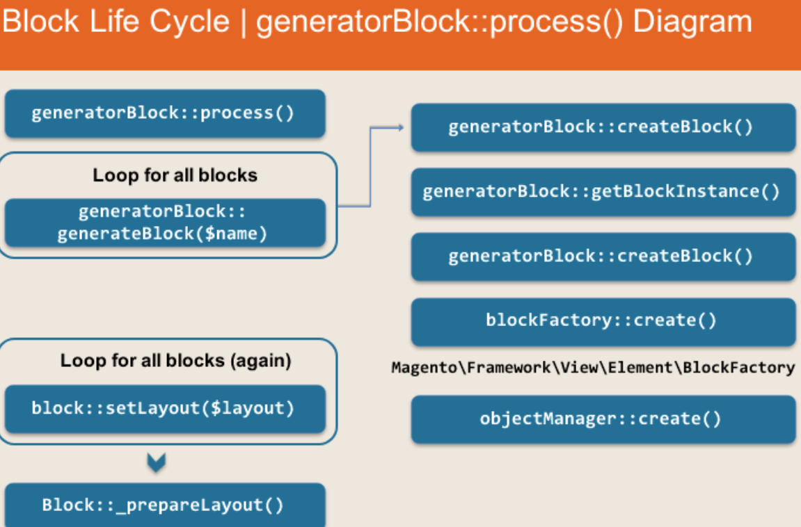


* **GeneratorContainer::process()**
  * not a physical class, there is very little, generator container only manages attributes.


* **Rendering**  
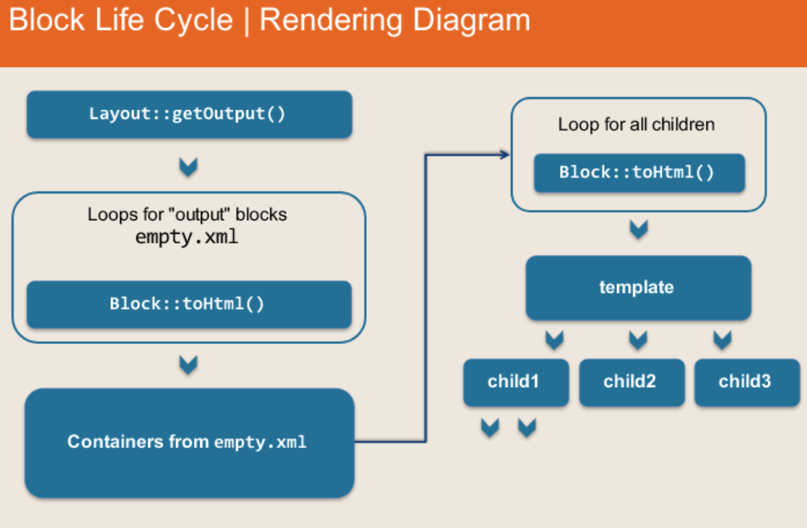

#### Templates
* Snippets of HTML code (.phtml) that contain PHP elements such as: PHP, Variables, Calls for class methods.
* Located in ```view/_area_/templates``` where \_area_ is frontend/adminhtml etc.
* Fallback: process of defining the full path to a file given only its relative path.
  * ```product/view/details.phtml``` becomes ```Magento_Catalog/view/frontend/templates/product/view/details.phtml```
* ```Block::getTemplateFile()``` is most important step of Fallback flow.
  * Getting fallback takes place in the \_viewFileStystem object which is an instance of Magento\Framework\View.
* **Customizing Templates**
 * 3 Steps to rewriting core template:
  1. Create your module
  2. Create a new template in your module
  3. Set your template to the block that contains the core template to rewrite

#### Layout XML Structure
* Tool to build layout in logical, flexible manner.
* Layout XML:
  1. Create page content in logical structure.
  2. Generate HTML content.
* Each update handle resides in it's own file.  More expressive and explicit.
* Each layout XML file is validated by the schema.  XML syntax easier to identify.
* Module can add content to pages without changing files in another module, can also move or remove existing content added by other modules.
* When all processed, rendered and displayed.
* Layout XML is composed of multiple sections, head, body, html and update.
* By creating Layout XML files as part of a module or theme it will merge those files on appropriate page.
* 2 possible root nodes for ```layout.xml file```, <page> or <layout>:
  * Within the Layout.xml file root <page> node, one or more sections can be declared.  ```html, body, head, update```
  * If the layout root node is <layout>, no page sections are specified, only blocks and containers. (parts)

###### Difference in M1 and M2
* Layout XML in M1 can be used to describe content, not bound to HTML representation.  Upgrade issues.
  * Page structure is generic.
* Layout XML schema is specifically suited for HTML, overwriting files is the non-default behavior.
  * Collections all XML and merges.  Must user special overriding directory to overwrite but not recommended.

###### Directories
* Layout.xml files can be found in Modules or Themes:
```
app/code/[Namespace]/[Nodule]/view/[area]/layout/*.xml
```
```
app/design/frontend/[Namespace]/[theme]/[Namespace]_[Module]/layout/*.xml
```
#### head Section
* new element to M2
* add resources to page in the ```layout.xml``` file.
* each type of include has it's own tag.
* ```<css>``` element can take direct file name or module name
  * attribute: src
* ```<link>``` for loading Javascript
  * attribute: src, ie_condition, defer
* ```<remove>``` removes a Javascript library from the page
  * attribute: src
* ```<title>``` edit title tag of head block
* ```<meta>``` typical meta attributes
* ```<attributes>``` configure attributes of the head
```XML
<page>
  <head>
    <css    src="Namespace_Module::css/some.css"/>
    <script src="some/library.js"/>
    <link   src="Namespace_Module::js/some.js"/>
    <title>Super Special Offer</title>
    <meta  name="x_ua_compatible" content="IE=edge,chrome=1"/>
    <attribute name="prefix" value="product:http://ogp.me/ns/product#"/>
  </head>
</page>
```

#### body Section
* where you can add actual content.
* declare containers, move elements with blocks, child/parent relationship replaced by ```<move>```
* when you reference blocks and containers you must explicitly say what you are referencing using ```<referenceBlock>``` and ```<referenceContainer>```.

###### 1. Attributes
* ```<attributes>``` define attributes of body element
  * attributes: name, value

```xml
<attribute name="data-ng-app" value="myProductSelector"/>
```

###### 2. Container
* ```<container>``` define attributes for container element
  * attributes: name, htmlTag, htmlClass, htmlId, label

```xml
<container name="additional.info" htmlTag="div" htmlClass="grey-box"
           htmlId="custom-content" label="Additional Content"/>```
results in
```xml
<div id="custom-content" class="grey-box">
````

###### 3. Reference Blocks
* ```<referenceBlock>``` add a child to a block defined somewhere else.

###### 4. Reference Containers
* ```<referenceContainer>``` container analog of referenceBlock.

###### 5. Remove
* ```remove``` any layout directive from the resulting xml on a page.  Uses name to reference node to remove.

```xml
<body>
    <referenceContainer name="header" remove="true"/>
    <referenceBlock name="menu" remove="true"/>
</body>
```

###### 6. UI Components
* ```<ui_component>``` predefined generic block instances that can be configured using layout xml as needed.
  * attributes:
    1. **name**: the internal block name of this UI component block instance. _Required_
    2. **component**: the name of the UI component to user. _Required_

```xml
<ui_compenent name="example"/>
```
would yield something like
```xml
<!-- example -->
<div class="pager">
    <span class="pages-total-found">Total 2048 records found</span>
    <... some other elements>
</div>
```

###### 7. Block Arguments/Argument
* Each ```<block>``` can take arguments that are then passed on to the constructor part of the data that is injected into the block through the object manager.  Each argument has a name and a type. If two different layout XML files reference the same block the 2nd one will overwrite the 1st.
  * attributes:
    1. **name**: name of argument to be set on the block. _Required_
    2. **xsi:type**: array, string, boolean, object, number, null. _Required_
    3. **translate**: true or false (only allowed if xsi:type == string)

```xml
<block class="..." name="...">
  <arguments>
    <argument name="title" translate="true" xsi:type="string">Edit Account</argument>
  </arguments>
</block>
```

###### 8. Block Actions/Action Elementa
* The ```<action>``` node is used to call methods on block instances.  Argument names have to be unique within the containing action. (deprecated do not use).
  * attributes:
    1. **name**: name of argument to be set on the block. _Required_
    2. **xsi:type**: array, string, boolean, object, number, null. _Required_
    3. **translate**: true or false (only allowed if xsi:type == string)

```xml
<block class="..." name="...">
  <arguments>
    <action method="setTitle">
      <argument name="title" translate="true" xsi:type="string">Edit Account</argument>
  </arguments>
</block>
```

###### 9. Specifying Argument Arrays
```xml
<!-- The xsi:type array -->
<arguments>
  <argument name="triggers" xsi:type="array">
      <item name="registerSubmitButton" xsi:type="string">.action.submit</item>
  </argument>
</arguments>
```

#### Layout XML Loading and Rendering
* Along with layout files loaded within the module directories, additional layout files are loaded from theme directories under ```app/design``` such as ```app/design/frontend/Magento/blank/*_*/layout/*.xml```
* Base area layouts are shared between frontend and adminhtml.
* Basic page layout is selected with the ```layout="..."``` attribute on the ```<page>``` root node.
  * Not every page tag needs to specify the layout attribute, only when creating a new page or changing layout of existing page.

###### Themes
* Theme inheritance is applied when Magento compiles the list of XML files.
* It recursively fetches each theme's parent until a theme without a parent is reached.
* This happens in method: ```Magento\Theme\Model\Theme::getInheritedThemes()```
  * Configured in ```theme.xml``` or ```composer.json``` file within the theme.
* Overriding theme files is not good practice because it introduces potential upgrade obstacles.
  * Theme can replace parent theme file by replacing the file in appropriate folder within the ```layout/override``` directory.
```
app/
 |-- design/
      |-- frontend/
          |--Training/
              |-- custom/
                  |-- Magento_Catalog/
                  |   |-- layout/
                  |       |-- override/
                  |           |-- theme/
                  |               |-- Magento/
                  |                    |-- blank/
                  |                         |-- catalog_product_view.xml
                  |-- Magento_Checkout/
                  |   |-- layout/
                  |       |-- default.xml
                  |-- theme.xml
```
* default.xml file will be merged with all other defeault.xml files from the parent themes and modules.
* catalog_product_view.xml will override the file with the same name from Magento/blank (parent)
* theme.xml is not a layout xml file but a theme configuration file

###### Handles
* Layout handles or update handles are how Magento view knows which layout XML instructions to process for a given request.
* Request that render output are associated with one or more handles.  Almost ever request is also associated with the default handle (default.xml).
* Instruction associated with the default handle apply to almost every page.  Always processed first.
* Page specific content is associated with a page using the action handle specific to the request.  The action handle consists of the route, controller, and action in lower case, separated by and underscore.
  * Processed after the default.
  * i.e. ```catalog_product_view```, ```customer_account_login```, ```cms_index_index```
* Custom handles can be added using either ```addHandle()``` method on the result page object ```Magento\Frameowkr\View\Result\Page``` or ```Magento\Framework\View\Result\Layout``` before the response is rendered.  Alternatively, custom handles can be added using the Layout XML ```<update>``` directive.

#### Quiz
1. In order to render a template, a block class has to extend: ```\Magento\Frameowrk\View\Element\Template```
2. Which of the directives will assign a template to a block in the layout xml file: ```<block template="test.phtml"/>```
3. Which file contains the initial structure of containers used by the page layout: ```empty.xml```
4. Which one of the elements of layout will automatically render all it's children: ```<container>```
5. Which block methods are available in a template: Only public getters (?)
