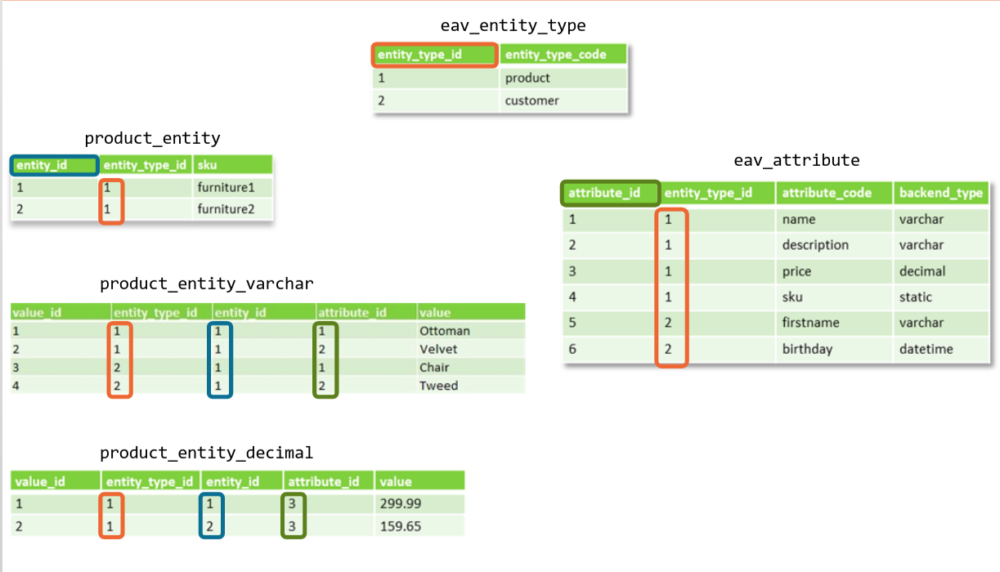

#### Layout XML how to set ViewModel into model  
* Offloads features from `Block` classes into separate `ViewModel` classes.  
* Extends `\Magento\Framework\View\Element\Block\ArgumentInterface`
* Add additional `XML` argument to the `Block` class.
* Reason? Simplifies the structure and clutter of your code, instead of extending `\Magento\Framework\View\Element\Template` and having to pass all DI for parent and child in constructor you just pass the DI for the ViewModel now without having to worry about parent.
* Instead of `$block->getSomething()` it's now `$viewModel->getSomething()`

```xml
<block class="Drewsauace\Example\Block\Dummy" name="dummy">
    <arguments>
        <argument name="view_model" xsi:type="object">Drewsauace\Example\ViewModel\Dummy</argument>
    </arguments>
</block>
```
```php
<?php
namespace Drewsauace\Example\ViewModel;

class Dummy implements \Magento\Framework\View\Element\Block\ArgumentInterface
{
    public function __construct()
    {
    }
}
```

#### Create a theme
Namespace: `Drewsauce`  
Theme: `Fresh`  
Path: `$MAGENTO_ROOT/app/design/frontend/Drewsauce/Fresh/`  
ThemeXML Path: `$MAGENTO_ROOT/app/design/frontend/Drewsauce/Fresh/theme.xml`  
Theme XML:
```xml
<theme xmlns:xsi="http://www.w3.org/2001/XMLSchema-instance" xsi:noNamespaceSchemaLocation="urn:magento:framework:Config/etc/theme.xsd">
     <title>Drewsauce Theme</title> <!-- your theme's name -->
     <parent>Magento/blank</parent> <!-- the parent theme, in case your theme inherits from an existing theme -->
     <media>
         <preview_image>media/preview.jpg</preview_image> <!-- the path to your theme's preview image -->
     </media>
 </theme>
```
RegistrationPath:`$MAGENTO_ROOT/app/design/frontend/Drewsauce/Fresh/registration.php`
```php
<?php
\Magento\Framework\Component\ComponentRegistrar::register(
    \Magento\Framework\Component\ComponentRegistrar::THEME,
    'frontend/Cloudways/Mytheme',
    __DIR__
```

#### View: Blocks, Layouts, Templates
1. Create Controller
 * Create a routes.xml, Create correct action class and implement `execute()` method.
 * Controllers extend `\Magento\Framework\App\Action\Action` located at `app/code/{namespace}/{module}/Controller/{Index}/{Display.php}`

```php
<?php
namespace Drewsauce\HelloWorld\Controller\Index;

class Display extends \Magento\Framework\App\Action\Action
{
	protected $_pageFactory;
	public function __construct(
		\Magento\Framework\App\Action\Context $context,
		\Magento\Framework\View\Result\PageFactory $pageFactory)
	{
		$this->_pageFactory = $pageFactory;
		return parent::__construct($context);
	}

  // Controller must have execute method to process logic
	public function execute()
	{
		return $this->_pageFactory->create();
	}
}
```
2. Create Layout
  * TODO: https://www.mageplaza.com/magento-2-module-development/view-block-layout-template-magento-2.html

#### Relation between block and template (phtml) (ex. One block to multiple templates)  
* Extends AbstractBlock  
* Block Types: Text, ListText, Messages, Redirect, Template
* Block creates a link between layouts and templates.  Blocks are defined using `<block>` element in `layout.xml` file.
* One block can contain multiple templates. Block can be used in multiple pages or other blocks.
* Block Flow: `_prepareLayout()` -> `toHtml()` -> `_beforeToHtml()` -> `_toHtml()` -> `_afterToHtml()`
  * recommended to not overwrite `toHtml()`, but instead the other `_toHtml()` methods, where specific rendering logic resides.
* Rendering Flow: `Layout::getOutput()` loops for all "output" blocks in  Containers `empty.xml` which calls `Block::toHtml()` for each block.  The block calls each of it's templates (`.phtml`) and those children, childrens children etc.

#### URL Processing
* http://magento.com/catalog/product/view/id/1
  * Front Name: `catalog` (Module Name 'Catalog')
  * Controller Name: `product` (ActionPath, 'Catalog/Product')
  * Action Name: `view` (Action Class, 'View.php')
  * Parameters: `id=1`

#### Front Controllers
* First step in handling requests and workflows in a request.
* Gathers all routers, finds matching controller/router, obtains HTML generated to response object.
* Implements `FrontControllerInterface` and has one method, `dispatch()`

#### Request Flow
* `index.php` -> `Bootstrap::run()` -> `App::launch()` -> `FrontController::dispatch()` -> `Router::match()` -> `Controller::execute()` -> `View::loadLayout()` -> `View::renderLayout()` -> `Response::sendResponse()`
* Action\Action and Controller are used interchangeably.

#### Routing Path  
* `FrontController::dispatch()` -> `Base Router` -> `URL Rewrite Router` -> `CMS Router` -> `Default Router` -> `Robot Controller Router`

#### Magento Vault  
1. Adding vault enabling controls.
2. Modifying the payment component (updating of the additional_data property must be added).
3. Creating a request data builder.  
4. [Vault](https://devdocs.magento.com/guides/v2.3/payments-integrations/vault/enabler.html)

#### Adding new field for customer address  
[Add new field to customer address](https://devdocs.magento.com/guides/v2.3/howdoi/checkout/checkout_new_field.html)

#### Adding Attribute by Setup  
* `Magento\Eav\Setup\EavSetup` used for EAV-based modules extend their setup class from it.  Implements methods for adding/manipulating attributes.
* Used by `[Module_Name]\Setup\{InstallData, UpgradeData}` to add or modify attributes.

```php
<?php
public function install(ModuleDataSetupInterface $setup, ModuleContextInterface $context)
{
  $eavSetup = $this->eavSetupFactory->(['setup' => $setup]);

  $eavSetup->addAttribute(
      \Magento\Catalog\Model\Product::Entity,
      'is_featured',
      [
          'group' => 'General',
          'type' => 'int',
          'backend' => '',
          'frontend' => '',
          'label' => 'Is Featured',
          'input' => 'boolean',
          'class' => '',
          'source' => 'Magento\Eav\Model\Entity\Attribute\Source\Boolean',
          'global' => \Magento\Eav\Model\Entity\Attribute\ScopedAttributeInterface::SCOPE_GLOBAL,
          'visible' => true,
          'required' => false,
          'user_defined' => false,
          'default' => '1',
          'searchable' => false,
          'filterable' => false,
          'comparable' => false,
          'visible_on_front' => false,
          'used_in_product_listing' => false,
          'unique' => false,
          'apply_to' => ''
      ]
  );
}
```

#### Magento Setting, Total Amount Order Display  
`vendor/magento/module-store/etc/config.xml` under `<config><default><sales><totals_sort>`  
`System->Configuration->Sales->Checkout Total Sort Order`

#### In which XML file are the default store configuration are set  
`vendor/magento/module-store/etc/config.xml`

#### How to use repositories to filter results  
For filtering results for a say, a product.  We need a new class which has `ProductRepositoryInterface` and `SearchCriteriaBuilder` classes passed in via DI.  You can set a filter such as this:
```php
<?php
namespace Vendor\ModlueName\Model;

use Magento\Framework\Api\SearchCriteriaBuilder;
use Magento\Catalog\Api\ProductRepositoryInterface;

class ProductFilterDemo
{
    /** @var ProductRepositoryInterface */
    protected $productRepository;

    /** @var SearchCriteriaBuilder */
    protected $searchCriteriaBuilder;

    /**
     * Initialize dependencies.
     *
     * @param ProductRepositoryInterface $productRepository
     * @param SearchCriteriaBuilder $searchCriteriaBuilder
     */
    public function __construct(
        ProductRepositoryInterface $productRepository,
        SearchCriteriaBuilder $searchCriteriaBuilder
    ) {
        $this->productRepository = $productRepository;
        $this->searchCriteriaBuilder = $searchCriteriaBuilder;
    }

    /**
     * Get products with filter.
     *
     * @param string $fieldName
     * @param string $fieldValue
     * @param string $filterType
     * @return \Magento\Catalog\Api\Data\ProductInterface[]
     */
    public function getProducts($fieldName, $fieldValue, $filterType)
    {
        $searchCriteria = $this->searchCriteriaBuilder->addFilter($fieldName, $fieldValue, $filterType)->create();
        $products = $this->productRepository->getList($searchCriteria);
        return $products->getItems();
    }
}
```

Ex:
```php
<?php
// Check out the following sample class. To filter by SKU, try this:

$productFilterDemo->getProducts('sku', 'product_sku_value', 'eq');
// To get products created after specific date, this:

$productFilterDemo->getProducts('created_at', 'creation date', 'gt');
```

#### Which options would you use for adding new attributes to be included in flat table
* using`UpdateSchema` to add a column `attribute` to said table.

```php
<?php
use Magento\Framework\Setup\UpgradeSchemaInterface;
use Magento\Framework\Setup\ModuleContextInterface;
use Magento\Framework\Setup\SchemaSetupInterface;

class UpgradeSchema extends UpgradeSchemaInterface
{
  public function upgrade(SchemaSetupInterface $setup, ModuleContextInterface $context)
  {
    $setup->startSetup();
    // ... logic
    $setup->endSetup();
  }
}
```

#### Client would like to have custom URL for sorting (/dress-sort-by-name-filter-by-sale)  
* Need to convert the non-standard URL to a standard Magento URL by parsing it and setting it in `$request`  
* ``$request->setModuleName('')->setControllerName('')->setActionName('')->setParam('','');``

#### Which steps are required to add new online payment methods  
* Module must have dependencies on `Magento_Sales`, `Magento_Payment`, and `Magento_Checkout` in `composer.json` and `module.xml`

```xml
<config xmlns:xsi="http://www.w3.org/2001/XMLSchema-instance" xsi:noNamespaceSchemaLocation="urn:magento:framework:Module/etc/module.xsd">
    <module name="Vendor_Module" setup_version="2.0.0">
        <sequence>
            ...
            <module name="Magento_Sales"/>
            <module name="Magento_Payment"/>
            <module name="Magento_Checkout"/>
            ...
        </sequence>
    </module>
</config>
```
* Must implement `/etc/config.xml` [such as this](https://devdocs.magento.com/guides/v2.3/payments-integrations/base-integration/payment-option-config.html)
* Implement Payment Method Facade instance of Payment Adapter in `/etc/di.xml` and follow arguments [must be configured](https://devdocs.magento.com/guides/v2.3/payments-integrations/base-integration/facade-configuration.html):  
  * `code`, `formBlockType`, `infoBlockType`, `valueHandlerPool`, `validatePool`, `commandPool` 
* Implement and configure payment actions like authorize, void, etc.
* Add payment method to Admin, Checkout.

#### Plugins Lifecycle  
* Extend the behavior of native method within a Magento Framework class.
* Plugins are combination of events and rewrites (features of M1).
* Uses `before` `after` or `around` methods to modify arguments/returned values from an original method of a core class.
* Dependant on `sortOrder`, smallest value is highest priority. Higher value is lower priority.
* __Note:__ Overriding a class is a conflicting change, meaning other extensions that declare a plugin for the same method might cease to function. Extending a class's behavior is a non-conflicting change.
* __Note:__ Order: `before` listener with highest priority, `around` listener with highest priority, `before` with lower priority, `around` with lower priority, `after` with lower priority -> higher priority.
* Requires `di.xml`

```xml
<config>
<type name="{ObservedType}"/>
    <plugin name="{PluginName}"
            type="{PluginClassName}"
            sortOrder="1"
            disabled="true"/>
</config>
```

#### Would a single not cacheable block disable page cache for given page  
* Disabling a cache for a block on a page would disable caching for the whole page.

#### Widgets XML and dataSources  
* A Widget is basically an extension (Module) designed to provide a set of advanced configuration options. Due to greater flexibility and control, they are used to provide information and marketing content via the Magento Administrator panel.
* Located at `/app/code/<Namespace>/<ModuleName>/etc/widget.xml`.
* __DataSource__ requires a __DataProvider__ which is the class that obtains data, implements specific interface.
* `DataSource` is javascript, but requires `DataProvider` which is a PHP class to obtain and hand off the data.
* Every DataProvider must extend `Magento\Ui\DataProvider\AbstractDataProvider`.  
  * Implements `getData()` which is used to extract data to Javascript.
  * Has abstract method `getCollection()` which needs to be implemented in a specific `DataProvider`.

#### Standard product types (simple, configurable, bundled, etc.).  
1. __Simple Product:__ It’s the most popular basic type of products. It corresponds to the existing product with a unique SKU (Store Keeping Unit).
2. __Virtual Product:__ This type of product is used to create products that are not physically present on the store (paid subscriptions, services, insurance, etc.).
3. __Configurable Product:__ This type allows you to create products with a list of variations. For example, a sports T-shirt of different colors and sizes. Each variation of a configurable product corresponds to a Simple Product, which has its own unique SKU, which allows you to keep track of the residuals for each option.
4. __Grouped Product:__ This type allows you to combine into sets individual Simple or Virtual Products, that are somehow related to each other. As a result, a buyer gets an opportunity to buy all the needed products at once, instead of buying them separately. On the page of a Grouped Product customers can choose particular products that they would like to purchase from the set, as well as their quantity. The selected products are added to cart as individual items.
5. __Bundle Product:__ This type of product allows customers to independently “create” a product using a set of options.
6. __Downloadable Product:__ This type of product is used to create digital products that can be represented by one or multiple files and can be downloaded by customers.

#### Customize actions of adding products to cart  
* Observer for `checkout_cart_product_add_after`

#### Final price in product view, what calculations.
* Final price is a column for a product, it is the minimum price of many prices.

#### How to add manufacturer image on each product in checkout cart  
* Create `di.xml` under `app/code/[Namespace]/[Module]/etc/frontend`
* Create `Image.php` under `app/code/[Namespace]/[Module]/Plugin/CheckoutCart`
```php 
<?php
 
namespace Drewsauce\CartImageReplacement\Plugin\CheckoutCart;
 
class Image
{
    public function afterGetImage($item, $result)
    {
     if(YOUR_CONDITION) {
     $result->setImageUrl( YOUR_IMAGE_URL );
     }
     return $result;
    }
}

```

#### Replace image in the item on configurable product on checkout cart  
* With the so-called Configurable Swatches which allow "Product Image Swap".
  * Swap images defined by Option Label
    * ne way to configure swap images is to upload images to a configurable product with labels exactly matching the specific option labels (for example, Royal Blue).
  * Swap images defined by Base Image
    * Another way to configure swap images is to upload base images to each child product of the configurable product.

#### Model
* Must know what resource model to use.  Passed in the `_init()` function in the `_construct()`
* Notice these are protected function and not PHP magic methods because they have one underscore.  
* Each Model must have a ResourceModel, and ResourceCollection.
* Models encapsulate storage independent business logic.  Models don't know about storage persistence.
* Resource Models encapsulate the storage layer logic.  All storage actions are responsibility of ResourceModel.
* Resource Collections represent list of models of a specific type. Used for working with multiple records.

```php
<?php
class Block extends \Magento\Framework\Model\AbstractModel implements BlockInterface, IdenttiyInterface
{
  // Passes Resource Model through Model class.
  protected function _construct() {
    $this->_init(\Magento\Cms\Model\ResourceModel\Block::class);
  }
}

abstract class AbstractModel extends \Magento\Framework\Object
{
  protected function _init($resourceModel) {
    $this->_setResourceModel($resourceModel);
    $this->_idFieldName = $this->_getResource()->getIdFieldName();
  }
}
```

#### Resource Model
* extends `\Magento\Framework\Model\Resource\DB\AbstractDb`
* define table man and primary key attribute.

```php
<?php
class Block extends \Magento\Framework\Model\resource\DB\AbstractDb
{
  // Sets _idFiledName and _mainTable
  protected function _construct() {
    $this->_init('cms_block', 'block_id');
  }
}

abstract class AbstractDb extends \Magento\Framework\Model\Resource\AbstractResource
{
  protected function _init($mainTable, $idFieldName) {
    $this->_setMainTable($mainTable, $idFieldName);
  }
  protected function _setMainTable($mainTable, $idFieldName = null) {
    $this->_mainTable = $mainTable;
    if(null === $idFieldName) {
      $idFiledName = $mainTable . '_id';
    }
    $this->_idFieldName = $idFieldName;
    return $this;
  }
}
```

#### Collection to Model
* Needs to know Model and Resourcemodel  

```php
<?php
class Collection extends \Magento\Framework\Model\ResourceModel\Db\Collection\AbstractCollection
{
  protected function _construct()
  {
    $this->_init(
      \Magento\Cms\Model\Block::Class,
      \Magento\Cms\Model\ResourceModel\Block::Class
    );
    $this->_map['fields']['store'] = 'store_table.store.id';
    $this->_map['fields']['block_id'] = 'main_table.block_id';
  }
}
```

#### EAV (Entity Attribute Value)
* Separates values from attributes and entities.
* Encapsulates attribute-related business logic.
* Makes multi-scope values possible.
* Makes adding and removing attributes very easy, not a column everytime you have to add an attribute.
* Core EAV tables are prefixed with `eav`
* Each attribute is assigned a backend type (varchar, int, decimal, text)
* Entity tables are split; each EAV entity has its own entity table (i,e, )`customer_entity`)
* Special, unique attributes with global scope are integrated into entity tables (i.e. customer email, product sku); these special attributes have a static backend type because they exist in a core `eav` table.
* Attribute value tables are also split by entity type and backend type. Default naming convention follows the table such as `catalog_product_entity_*` where `*` is associated with it's backend type of: `_int, _decimal, _varchar, _text, _datetime`.  So a varchar would be stored in `catalog_product_entity_varchar`
* Some information is duplicated between tables for performance. (i.e. `entity_type_id` is also part of attribute value tables)
* Main properties of `entity-type`: `entity_type_id`, `entity_type_code`. `entity_table`, `default_attribute_set_id`, `increment_model`.
* Main properties of `entity-attribute`: `attribute_code`, `backend_type`, `backend_model`, `source_model`, `frontend_model`.

* EAV Model extends `Magento\Framework\Model\AbstractModel` as a regular model would.
* EAV ResrourceModels do not extend the same class, they extend `Magento\Eav\Model\Entity\AbstractEntity`
  * `getAttribute()` `saveAttribute()` `getWriteConnection()` `getEntityTable()`
* Attribute Models:
  * `Backend` provides hooks for save, load, and delete operations with attribute value.
    * Alternative to Observer or Plugin.
  * `Source` options for select and multiselect attributes.
  * `Frontend` rendering attribute values on the frontend.
* If an EAV entity type has an attribute with the code `increment_id` and no backend model is set, the `Magento\Eav\Model\Entity\Increment` model is assigned automatically.  Sets new `increment_id` in `beforeSave()` hook method.

#### Module
* Required to have `module.xml` and a `setup_version`
* Install scripts only run once.
* Upgrade scripts are run after an install and upon subsequent upgrades.
* Always put `startSetup()` and `endSetup()` functions after your install logic.
* `$context` provides information such as information version so the installer can base it's logic on this if needed.

```php
<?php
use Magento\Framework\Setup\InstallSchemaInterface;
use Magento\Framework\Setup\ModuleContextInterface;
use Magento\Framework\Setup\SchemaSetupInterface;

class InstallSchema implements InstallSchemaInterface
{
  public function install(SchemaSetupInterface $setup, ModuleContextInterface $context)
  {
    $setup->startSetup();
    // ... logic
    $setup->endSetup();
  }
}
```

```php
<?php
use Magento\Framework\Setup\InstallDataInterface;
use Magento\Framework\Setup\ModuleContextInterface;
use Magento\Framework\Setup\ModuleDataSetupInterface;

class InstallData implements InstallDataInterface
{
  public function install(ModuleDataSetupInterface $setup, ModuleContextInterface $context)
  {
    // ... logic
  }
}
```

#### Steps to Install Module
`php bin/magento module:enable <module> --clear-static-content`  
`php bin/magento setup:upgrade`  
`php bin/magento module:status`

#### API
* __Function of API in Magento 2__ Provides a structured form of communication between modules.
* __Three descriptors of Magento 2 Components__: Business API, Data API, Repository.
* __Why would you use an API rather than a Magento 1 object (such as a collection)?__ Fetch a list of objects from the database, save or delete an object.
* Operational API: Business Logic API and Repositories
  * Repositories provide service level collections.
  * Business Logic API: Business Logic operations.
* Framework API:
  * Interfaces, implementations, and classes for various parts.

#### Repositories/Search Criteria & Collections
* __Repository__
  * Provide access to databases through the services API.
  * Unchanged with new releases.
  * Deals with data objects.
  * Provides high-level acess to the data.
  * Supports SearchCriteria mechanism for filtering and sorting.
  * Does nor provide low level access to the database.
* __Collection__
  * Might be changed, or totally replaced with different mechanism.
  * Returns list of Magento Models
  * Provides low-level access to the database.
  * Provides own interface for most of the database operations, highly customizable.
  * Provides access to the select object, gives ability to create custom queries.

#### Describe how to filter, sort, and specify the selected values for collections and repositories.
* __Repositories__
  * `SearchCriteria`.
  * First, all filters are created using `filterBuilder` are added to the builder, then the `SearchCriteria` object is instantiated using the builder's `create()` method.
  * `SearchCriteria` implements `SearchCriteriaInterface` and extends class `AbstractSimpleObject`, uses `Search\FilterGroup` which uses `Filter`
  * `SearchCriteriaBuilder` extends `AbstractSimpleObjectBuilder`
```php
<?php
public function getLoggedInGroups()
{
  $notLoggedInFilter[] = $this->filterBuilder
    ->setField(GroupInterface::ID)
    ->setConditionType('neq')
    ->setValue(self::NOT_LOGGED_IN_ID)
    ->create();
  $groupAll[] = $this->filterBuilder
    ->setField(GroupInterface::ID)
    ->setConditionType('neq')
    ->setValue(self::CUST_GROUP_ALL)
    ->create();
  $searchCriteria = $this->searchCriteriaBuilder
    ->addFilters($notLoggedInFilter)
    ->addFilters($groupAll)
    ->create();
  return $this->groupRepository->getList($searchCriteria)->getItems();
}
```
  * `FilterGroup` extends `AbstractSimpleObject`, `FilterGroupBuilder` extends `AbstractSimpleObjectBuilder`
    * `Filter` object exposes setters, however, like the `SearchCriteria` it will often be built using the `FilterBuilder` which injects all values during insantiation.
  * `SortOrder` extends `AbstractSimpleObject`, `SortOrderBuilder` extends `AbstractSimpleObjectBuilder`
* __Collections__
  * Use 

### Quiz:
__A regular Magento 2 route has how many chunks?__ `4`  
__Which config file is used to define a frontName that the module's controllers will process?__ `routes.xml`  
__Which method should a standard controller implement?__ `execute()`  
__Which of the following is a front controller responsibility in Magento 2?__ `To define a router.`  
__A controller should return an instance of which class to render a json array?__ `\Magento\Framework\Controller\Result\Json`  
__In order to render a template, a block class has to extend:__ `\Magento\Frameowrk\View\Element\Template`  
__Which of the directives will assign a template to a block in the layout xml file:__ `<block template="test.phtml"/>`  
__Which file contains the initial structure of containers used by the page layout:__ `empty.xml`  
__Which one of the elements of layout will automatically render all it's children:__ `<container>`  
__Which block methods are available in a template:__ `Only public getters`  
__In order to add a new attribute to a product, you should use:__ `Setup/InstallData.php`  
__To make product attributes listed on the "More Info" tab of the Product Details page appear, which property in the installs script has to be set:__ `visible`  
__Which collection method allows you to add a where clause into the query generated by a collection object?__ `addFieldToFilter()`  
__Which of the following class types are used to fetch multiple records from a database:__ `Collection (?)`  
__Which of the following files should be used to create a new table:__ `Setup/InstallSchema.php`  
__Which of the following is a requirement for a class to implement a data interface:__ `It must be a resource model`  
__What object is typically returned by the getList() method of a repository:__ `SearchResult`  
__How can you assign the implementation of an API interface class:__ `Use the preference mechanism in di.xml`  
__A typical getList() method in a repository class will use which object as a parameter:__ `SearchCriteria`  
__What class must every repository fixed:__ `The is no mandatory class to extend`  
__Which file is responsible for adding new configuration options to system configuration (under etc/adminhtml):__ `system.xml`  
__Which one of the following is a class that admin actions must extend:__ `\Magento\Backend\App\Action`  
__In order to add a new column to a grid, you should:__ `Add a new column in the layout xml file`  
__In order to create a grid, you should use a(n):__ `UiComponent`  
__Which method is responsible for checking acl permission in the admin actions:__ `_isAllowed()`  