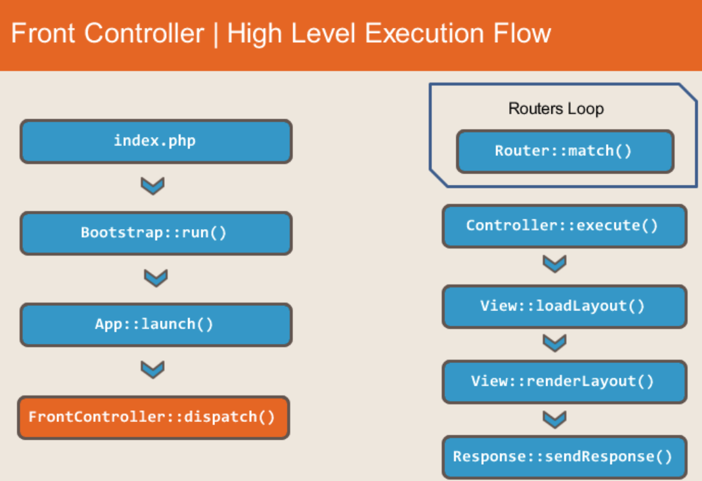
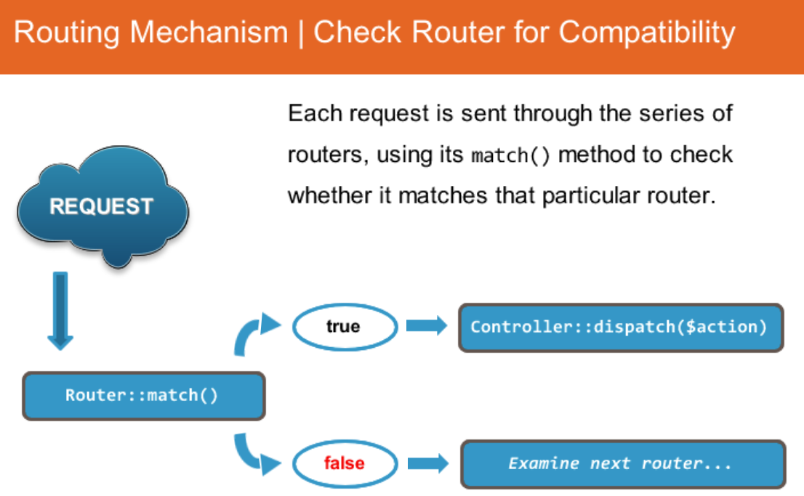
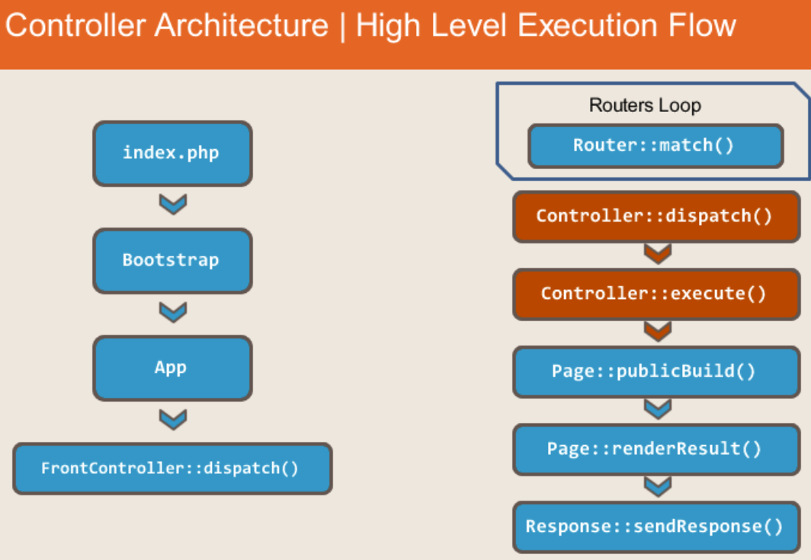
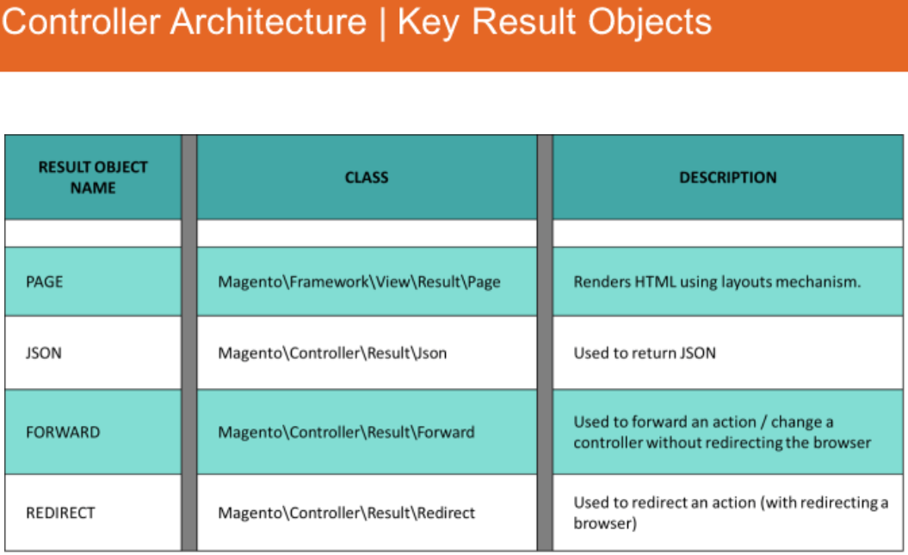
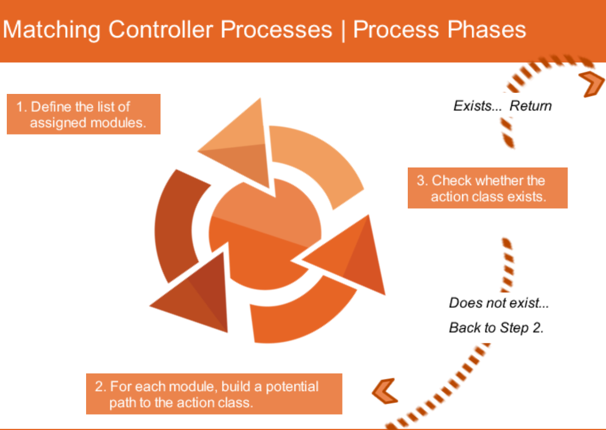
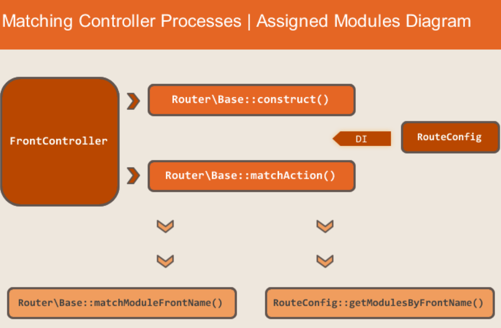
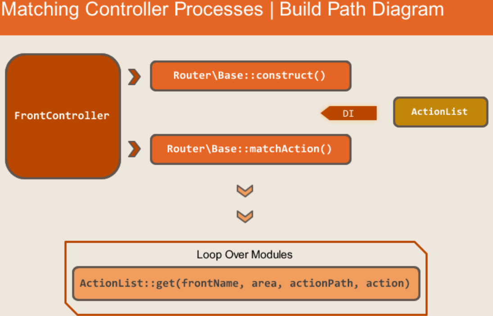
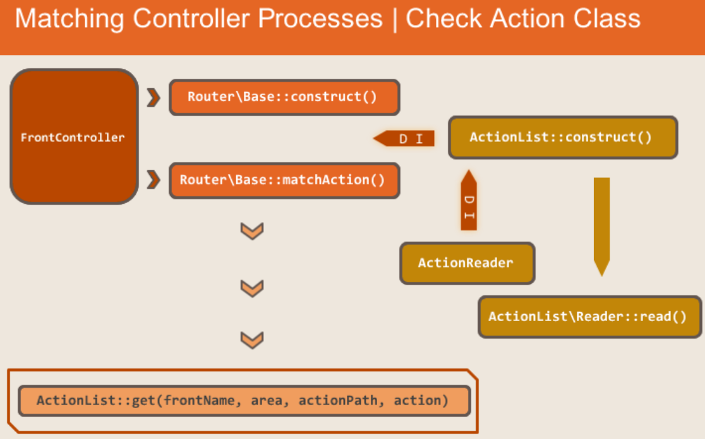
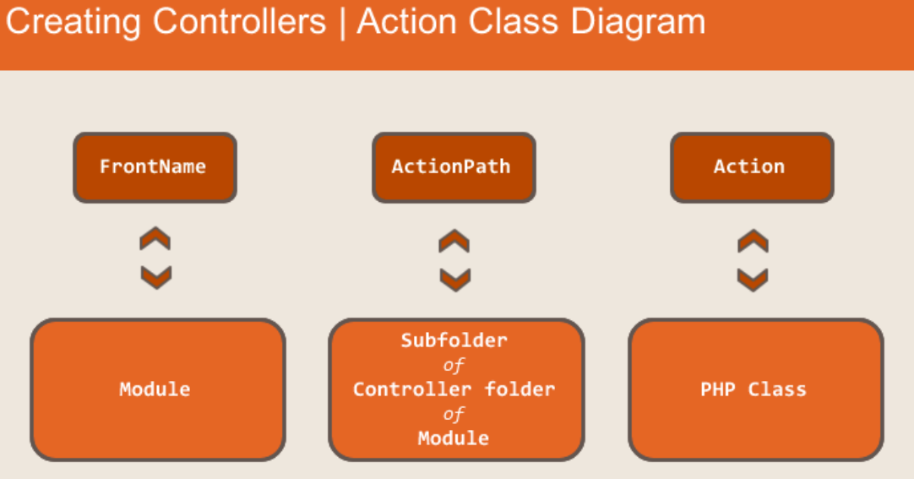

## Request Flow

* Definition: **Request Flow** refers to the sequence of steps an app takes to process and response to requests sent to it.

#### High Level Routing Flow Diagram
``` index.php -> Bootstrap -> App -> Routing -> Controllers -> Rendering -> Flushing Output ```

#### Initiation Phase
* Definition: Magento set up key objects to work, those using index.php and bootstrap.

#### Entry Points
* Definition: Magento starts processing a request.
  * ```index.php, pub/cron.php, pub/static.php, shell comamnds ```

#### Request Routing
* Front controller
* Routing mechanisms
* URL processing

###### Front Controllers
* first step in handling request flow
* responsibilities:
  1. Gathering all routers
  2. Finding matching controller/method
  3. Obtaining generated HTML to the response object



###### Routing Mechanism
* List of routers created using DI as a parameter.
* Router list
  1. Magento\Framework\App\Router\Base
  2. Magento\Framework\App\Router\DefaultRouter
  3. Magento\Cms\Controller\Router
  4. Magento\UrlRewrite\Controller\Router




###### URL Processing
* Same product can have multiple URLs
  * SEO etc
* Structure of the URL as accepted by the router is:
 ```java
    https://magento.com/catalog/product/view/id/1
    $baseUrl/$frontName/$controllerName/$actionName/$otherParams

    Front Name: catalog
    Controller Name: product
    Action Name: view
    Parameters: id=1
 ```

Non-standard Router
* Takes non-standard URL and turns it into a standard URL.


###### Controller Architecture
* controller is a class specific to a URL or group of URLS
* Controller can only process a single action
* action classes include:
  * ```execute()``` method
  * constructor (all dependencies are injected using DI)
  * extra methods and variables

> extend ```Action\Action``` because ```dispatch()``` is implemented here.  
```Action\Action``` is a class that almost every controller extends.  If a controller doesn't extend this class but, for example, directly implements ```ActionInterface```, it must implement the ```dispatch()``` method with specific logic.
As such logic is the same for all (native) controllers, they extend the ```Action\Action``` class and only implement the ```execute()``` method, not ```dispatch()```  
Action classes and controllers can be used interchangeably   
i.e. Catalog, Sales modules





###### Admin and Frontend controllers
* backend ```AbstractAction``` class contains:
  1. constructor with extra objects injected
  2. contains new ```dispatch()``` method
  3. contains ```_isAllowed()``` method
  4. Contains a set of other aux methods:
    * ``` _getsession() _addBreadCrumb() _addJs()  _addContent()  _addLeft()  _getUrl()```
  5. Has own implementation of ```redirect()``` and ```forward()``` methods
* Delegate execution of specific URL to other class, using ```forward()``` or ```redirect()```

###### Controllers
* Base Router:
  * most important of the four routers in Magento 2, base router matches almost all the actions.
  * Has a ```matchAction()``` method where almost every action is processed (except rewrites)
  * Every URL that the base router processes has the following structure: Three elements (frontName, actionPath, action) + parameters.










###### Creating Controllers
* Create a ```routes.xml``` files
* Create the correction action class and implement ```execute()``` method.
* Test


* Action class requirements:
  * Must extend ```Magento\Framework\App\Action\Action```
  * Must implement ```execute()``` method.

###### URL Rewrites
* Process of URL rewriting is used to make complicated URL addresses more "user-friendly"
* Can specify URL key on every static, content, and product category page.
* i.e. ```joust-duffle-bag.html => catalog/product/view/id/1```
> Magento rewrite process Flow
Browser sends request to server or application, accesses the url_rewrite table.  Then goes to ```Magento\UrlRewrite\Controller\Router``` and substitutes the values.

```PHP
<?php
  protected function getRewrite($requestPath, $storeId)
  {
      return $this->urlFinder->findOneByData([
        UrlRewrite::REQUEST_PATH => trim($requestPath, '/'),
        UrlRewrite::STORE_ID => $storeId,
      ]);
  }
```

**Unit 2 Question Answers:**  
1. A regular Magento 2 route has how many chunks?  ```4```  
2. Which config file is used to define a frontName that the module's controllers will process? ```routes.xml```  
3. Which method should a standard controller implement? ```execute()```  
4. Which of the following is a front controller responsibility in Magento 2? ```To define a router.```  
5. A controller should return an instance of which class to render a json array? ```\Magento\Framework\Controller\Result\Json```
