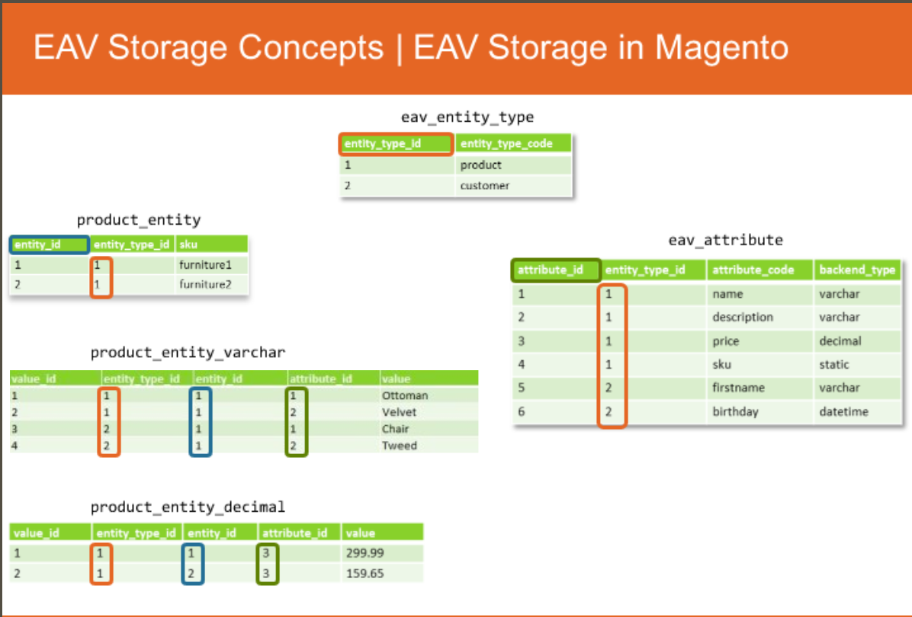
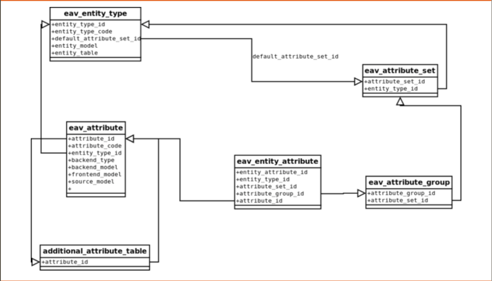
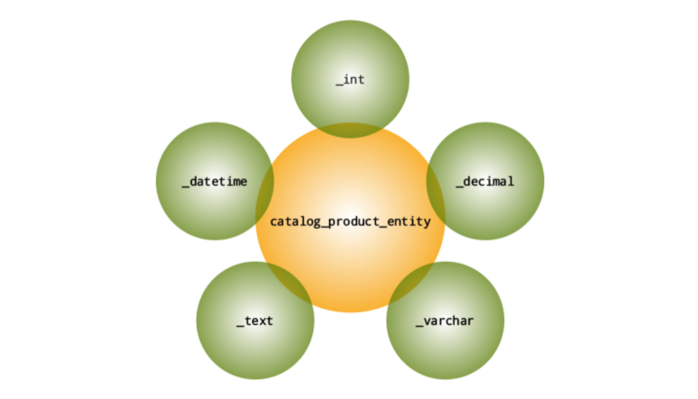

## Database

#### Overview
Object Relational mapping (ORM): technique used to access a relational database from an object oriented language.  

Magento ORM element:
* **Models**: Data + Behavior, entities
* **Resource Models**: Data mappers for storage structure
* **Collections**: Model sets & related functionality such as filtering, sorting, and paging
* **Resources**: such as a database connection via adapters.

Models encapsulate storage independent business logic.  
Resource Models encapsulate storage related logic.  Uses DB adapter. Populates model with data.  

Advantages of this model:
  * Decoupling of the business logic and storage layer.
  * Decoupling of the storage schema from the DB driver implementation (Data Mapper).


Database accessed via:
```
Magento\Framework\Db\Adapter\Pdo

Zend\Db
```

When creating a new model that interfaces with the database, just create the model class and extend it from the Magento frameowrk AbstractModel.
```php
<?php
class Block extends \Magento\Framework\Model\AbstractModel implements BlockInterface, IdentityInterface
{
  protected function _construct()
  {
    $this->_init('Magento\Cms\Model\Resource\Block')
  }
}
```

Resource Model extends ```\Magento\Framework\Model\ResourceModel\Db\AbstractDb```, must define table name and primary key and use ```_construct()``` method not PHPs ```__construct()```.
```php
<?php
class Block extends Magento\Framework\Model\Resource\Db\AbstractDb
{
  protected function _construct()
  {
    $this->_init('cms_block', 'block_id');
  }
}
```

#### Models Detailed Workflow
CRUD Workflow

Read
```php
// Requires an argument for retrieving records
// Always returns an object instance
// Allows specs of second argument for selecting a record based on a given property/column name
<?php
$resourceModel->load($model, $id, $field = null)
```
Save
```php
// Used for inserts and updates
<?php
$resourceModel->save($model)
```

Validate
```php
// Initiates validator factory
<?php
$resourceModel->validateBeforeSave($)
```

#### Setup Scripts & Setup Resources
* Install scripts are run only once per module
* Upgrade scripts are run after an install and upon subsequent upgrades
* ```setup_version``` is required to be set no matter what

```php
<?php
// Install must implement proper interface
use Magento\Framework\Setup\InstallSchemaInterface;
use Magento\Framework\Setup\ModuleContextInterface;
use Magento\Framework\Setup\SchemaSetupInterface;

class InstallSchema implements InstallSchemaInterface
{
  public function install(SchemaSetupInterface $setup, ModuleContextInterface $context)
  {
    $setup->startSetup();
    // ...logic
    $setup->endSetup();
  }
}

// Upgrade must implement proper interface
use Magento\Framework\Setup\UpgradeSchemaInterface;
use Magento\Framework\Setup\ModuleContextInterface;
use Magento\Framework\Setup\SchemaSetupInterface;

class UpgradeSchema implements InstallSchemaInterface
{
  public function upgrade(SchemaSetupInterface $setup, ModuleContextInterface $context)
  {
    $setup->startSetup();
    // ...logic
    $setup->endSetup();
  }
}

./magento setup:db:status
./magento setup:upgrade

```

#### EAV Concepts
Entity -> Attribute -> Value

* Separates values from attributes and entities
* Encapsulates attribute-related business logic
* Makes multiple-scope values possible
* Makes adding and removing attributes very easy

Meta Information
* Entity type
* Attribute per entity type
* Attribute set and groups

Content
* Entity records
* Attribute values







#### EAV Entity Load & Save


#### Attribute Management


#### Quiz
1. In order to add a new attribute to a product, you should use: ```Setup/InstallData.php```
2. To make product attributes listed on the "More Info" tab of the Product Details page appear, which property in the installs script has to be set: ```visible```
3. Which collection method allows you to add a where clause into the query generated by a collection object ```addFieldToFilter()```
4. Which of the following class types are used to fetch multiple records from a database: ```Collection``` (?)
5. Which of the following files should be used to create a new table: ```Setup/InstallSchema.php```
